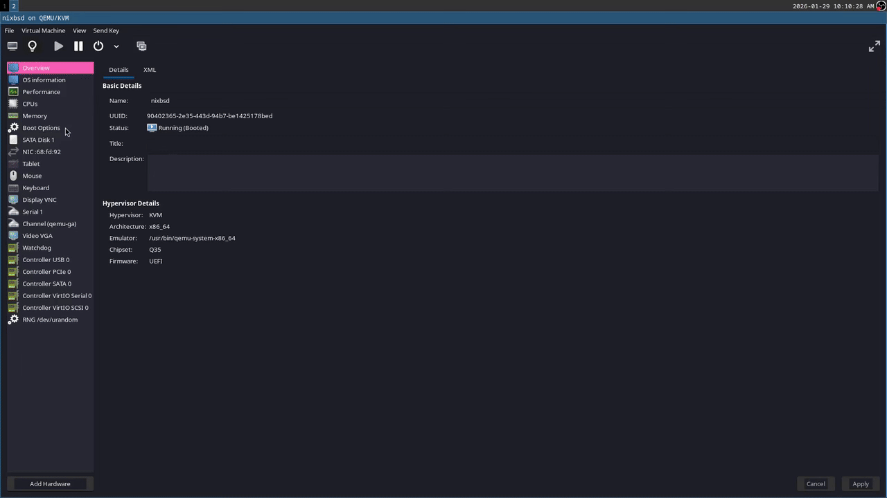

# NixOS + NixBSD Dual Boot



A reproducible dual-boot system combining NixOS and NixBSD on a single ZFS pool, with GRUB chainloading the FreeBSD bootloader.

## What's Inside

- **NixOS** for the Linux environment and GRUB bootloader
- **NixBSD** (FreeBSD 15) cross-compiled from Linux
- **Single flake** managing both systems

## Quick Start

Download the latest disk image from [Releases](https://github.com/jonhermansen/nixbsd-shared-flake/releases) and boot with:
```bash
# Using libvirt/virt-manager:
# - Firmware: UEFI
# - Disk bus: SATA
# - Attach the .img file as a disk

# Or with QEMU directly:
qemu-system-x86_64 \
  -enable-kvm \
  -m 2048 \
  -bios /usr/share/ovmf/OVMF.fd \
  -drive file=nixos.root.img,format=raw
```

Default credentials: `nixos` / `nixos` (or `root` / `toor`)

## Building Locally
```bash
nix build .#zfsImage
# Result: ./result/nixos.root.img
```

Dependencies are cached at [jonhermansen.cachix.org](https://jonhermansen.cachix.org).

## Related Projects

- [nixbsd fork](https://github.com/jonhermansen/nixbsd/tree/main)
- [nixpkgs fork](https://github.com/jonhermansen/nixpkgs/tree/beachepisode/)

---

*This is experimental software. NixBSD can only be cross-compiled from Linux at this time.*
